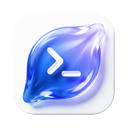
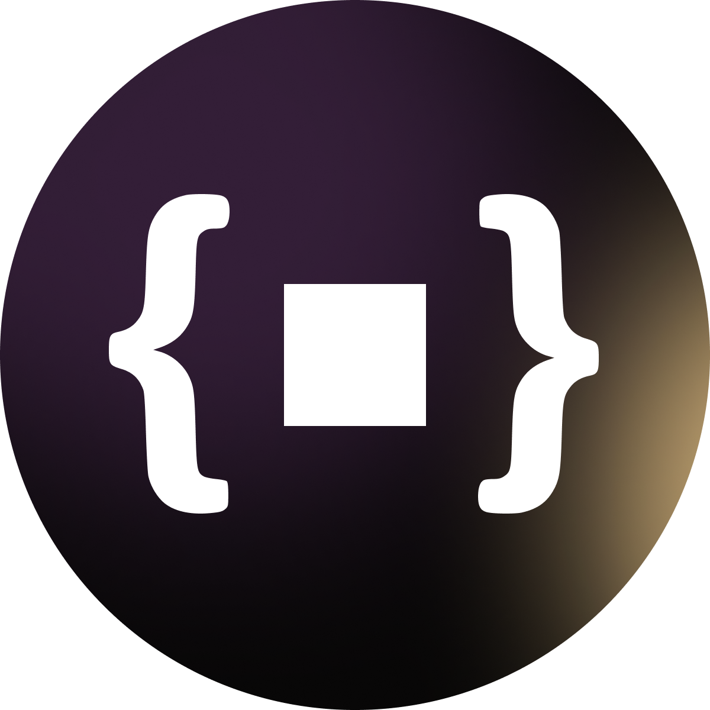

<a href="README_FR.md">🇫🇷 Français</a>

# Arthur Jean

Solo Indie Maker building developer tools, coding agent workflows, open-source software, and products for the new ways of coding.

I care about developers staying at the center of the loop. Agents can write more code, but taste, architecture, debugging, product sense, and responsibility still come from technical people.

## Active Projects

-  **[paneflow](https://github.com/arthjean/paneflow)** · Local-first Rust/GPUI workspace for running and supervising coding agents in parallel: real terminal panes, live agent state, worktree review, and a read-only MCP bridge ([paneflow.dev](https://paneflow.dev/))
- **[kepler-terminal](https://github.com/arthjean/kepler-terminal)** · Modern Rust terminal engine for Paneflow and agentic dev tools: renderer-agnostic core, huge scrollbacks, deterministic replay, and clean embedding.
- **[Numen](https://github.com/arthjean/numen)** · Native Rust AI coding agent that lives in your terminal: model-agnostic headless core, real tools, structured events, no Node runtime, built to embed in Paneflow.
-  **[distill](https://github.com/arthjean/distill)** · Open-source MCP server that compresses context at the source: build output, logs, diffs, and file reads get distilled before they hit the context window, through 3 always-loaded tools ([distill-mcp.com](https://distill-mcp.com))
-  **[rust-doctor](https://github.com/arthjean/rust-doctor)** · One-command health check for Rust projects: clippy, cargo-audit, cargo-deny, cargo-geiger, and 19 custom AST rules folded into a 0-100 score with actionable diagnostics ([rust-doctor.vercel.app](https://rust-doctor.vercel.app/))

---

### Daily tools

